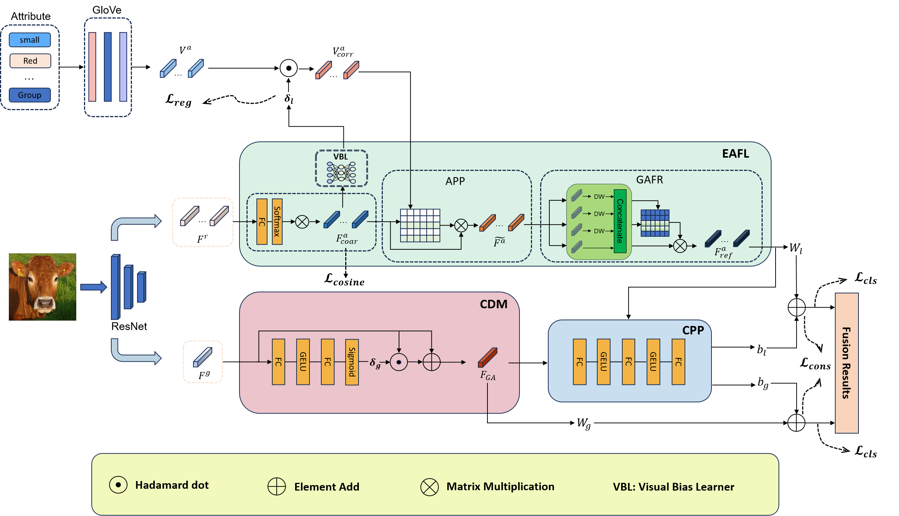

# ETN

## Achitecture
                                                

## Running Environment
The implementation of **ETN** is mainly based on Python 3.7.16 and [PyTorch](https://pytorch.org/) 1.12.1. To install all required dependencies:
```
$ pip install -r requirements.txt
```

### Preparing Dataset and Model

We provide trained models on three different datasets: (https://pan.baidu.com/s/1cfN3lu-_fTOc8LaOhmv1Uw?pwd=1111) Extraction code：1111

## References
Parts of our codes based on:
* [FaisalAlamri0/ViT-ZSL](https://github.com/FaisalAlamri0/ViT-ZSL)            

## Contact
If you have any questions about codes, please don't hesitate to contact us by yifanzhu12138@gmail.com.
